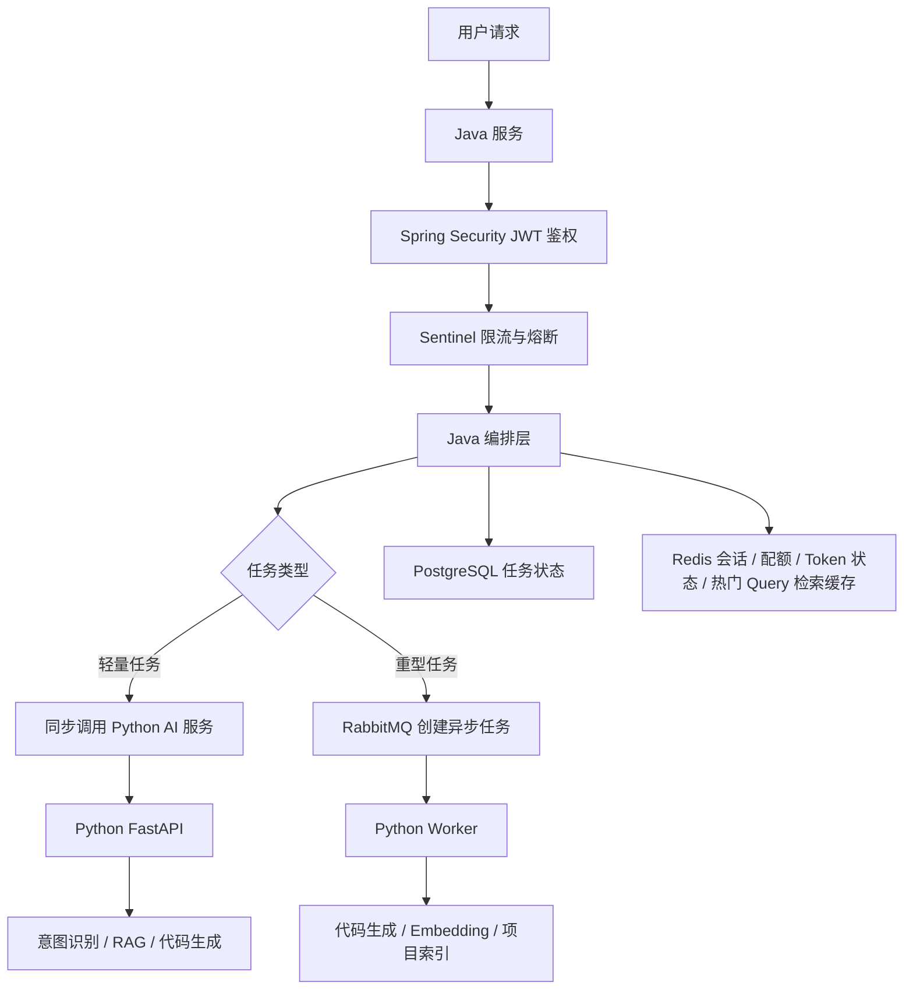

# Spring Security JWT、Sentinel、RabbitMQ 本地与远程部署实现方案

## 1. 背景

项目当前采用两层技术栈：

- Java：负责鉴权、限流、请求编排、任务管理。
- Python：负责 AI 能力，包括意图识别、RAG 检索、代码生成、向量化、索引构建等。

同时项目存在两套部署方式：

- 本地部署：适合开发、调试、单机验证。
- Docker 远程部署：适合测试环境、生产环境、多人使用和服务化运行。

本文档将 `Spring Security JWT`、`Sentinel`、`RabbitMQ` 分别拆成本地方案和远程 Docker 方案。

## 2. 总体推荐架构



推荐职责划分：

| 模块 | 职责 |
|---|---|
| Spring Security JWT | 认证用户身份、解析用户权限、识别租户 |
| Sentinel | 保护接口、限制 QPS、限制并发、熔断慢调用或异常调用 |
| RabbitMQ | 异步处理重型 AI 任务、削峰、重试、死信处理 |
| Redis | 保存会话状态、刷新令牌状态、用户配额、短期幂等锁、热门 Query 的 RAG 检索结果缓存 |
| PostgreSQL | 保存用户、任务、审计日志、失败样本 |
| Python AI 服务 | 意图识别、RAG、代码生成、向量化、索引构建 |

## 3. Spring Security JWT 实现方案

### 3.1 本地部署方案

本地部署目标是方便开发和调试，不追求复杂的认证中心。

推荐方式：

- Java 服务内置登录接口。
- 使用 Spring Security 校验 JWT。
- 使用本地配置中的 JWT 密钥。
- Access Token 有效期设置为 30 分钟到 2 小时。
- Refresh Token 可先简化为 Redis 或数据库存储。
- 本地 Redis 可选，如果本地环境不方便，也可以先使用内存存储，但不建议进入远程环境。

本地流程：

```text
用户登录
  -> Java 校验账号密码
  -> 签发 Access Token 和 Refresh Token
  -> 前端请求携带 Authorization: Bearer <access_token>
  -> Spring Security 校验 JWT
  -> 解析 user_id / tenant_id / roles
  -> 进入业务处理
```

本地建议配置：

| 配置项 | 建议 |
|---|---|
| 签名算法 | HS256 可用于本地开发，远程环境不推荐 |
| Access Token 过期时间 | 30 分钟到 2 小时 |
| Refresh Token 过期时间 | 7 天到 30 天 |
| Token 存储 | Access Token 不落库，Refresh Token 落 Redis 或数据库 |
| 用户权限 | 本地可使用固定测试用户 |
| 密钥管理 | 写入本地配置文件或环境变量 |

本地注意事项：

- 不要把本地 JWT 密钥提交到代码仓库。
- 本地可以放宽过期时间，但不要把这个配置带到生产。
- 本地可以使用测试账号快速登录，但要保留和远程一致的 token 字段结构。
- 即使是本地，也要模拟 `user_id`、`tenant_id`、`roles`，方便后续限流和任务归属。

推荐 JWT Claims：

```json
{
  "sub": "user_id",
  "tenant_id": "tenant_id",
  "roles": ["USER"],
  "scope": "rag:query code:generate",
  "iat": 1710000000,
  "exp": 1710003600,
  "iss": "yu-ai-code-mother",
  "aud": "yu-ai-code-api",
  "jti": "token_unique_id"
}
```

### 3.2 Docker 远程部署方案

远程部署建议更严格，最好将认证能力服务化。

推荐方式一：项目自建认证服务。

- 使用 Spring Authorization Server 或独立认证模块签发 JWT。
- 业务 Java 服务作为 Resource Server 校验 JWT。
- 使用 RS256 或 ES256 非对称签名。
- 私钥只在认证服务中保存。
- 业务服务只保存公钥，用于验证签名。
- Refresh Token 存 Redis 或数据库，支持吊销。

推荐方式二：接入成熟身份服务。

- Keycloak
- Casdoor
- Auth0
- Azure AD

如果项目未来会做多租户、企业用户、团队权限，推荐优先考虑 Keycloak 或 Casdoor。

远程流程：

```text
用户登录认证服务
  -> 认证服务签发 Access Token / Refresh Token
  -> 用户请求 Java API
  -> Java Resource Server 校验 JWT 签名、iss、aud、exp、scope
  -> Java 提取用户上下文
  -> 执行 Sentinel 限流
  -> 调用 Python 或投递 RabbitMQ
```

远程建议配置：

| 配置项 | 建议 |
|---|---|
| 签名算法 | RS256 或 ES256 |
| Access Token 过期时间 | 10 到 30 分钟 |
| Refresh Token 过期时间 | 7 到 30 天 |
| Refresh Token 存储 | Redis 或数据库，存哈希值 |
| Token 吊销 | 支持登出、踢下线、权限变更失效 |
| 密钥管理 | 环境变量、Docker Secret、K8s Secret |
| 服务间调用 | 使用内部服务 token 或 mTLS |

远程注意事项：

- Java 不要把用户 JWT 原样透传给 Python 服务。
- Python 服务应只接收来自 Java 内网调用或消息队列任务。
- Java 调 Python 时传递受控用户上下文，例如 `user_id`、`tenant_id`、`request_id`、`scopes`。
- JWT 中不要放密码、手机号、邮箱、API Key、模型密钥等敏感信息。
- 每次请求至少校验 `exp`、`iss`、`aud`、签名算法和权限范围。
- 权限变更后，旧 Access Token 可能仍然有效，所以 Access Token 必须短有效期。

## 4. Sentinel 实现方案

### 4.1 本地部署方案

本地部署目标是验证限流规则、熔断逻辑和 BlockHandler 是否正确。

推荐方式：

- Java 服务引入 Sentinel Web 或 Spring Cloud Alibaba Sentinel。
- 本地启动 Sentinel Dashboard。
- 规则可以先写在代码配置或本地配置文件中。
- 开发阶段重点验证接口资源名、限流返回结构、降级策略。

本地流程：

```text
用户请求
  -> Spring Security JWT 鉴权
  -> 提取 user_id / tenant_id
  -> Sentinel 按资源限流
  -> 放行后进入 Java 编排层
  -> 调用 Python AI 服务
```

本地建议资源命名：

| Sentinel 资源名 | 说明 |
|---|---|
| `api.chat` | 用户对话入口 |
| `api.intent.recognize` | 意图识别接口 |
| `api.rag.search` | RAG 检索接口 |
| `api.code.generate` | 代码生成接口 |
| `api.project.index` | 项目索引接口 |
| `client.python.intent` | Java 调 Python 意图识别 |
| `client.python.rag` | Java 调 Python RAG |
| `client.python.codegen` | Java 调 Python 代码生成 |

本地建议限流规则：

| 资源 | 本地建议 |
|---|---|
| `api.intent.recognize` | QPS 可较高，例如 20 |
| `api.rag.search` | QPS 中等，例如 5 到 10 |
| `api.code.generate` | QPS 较低，例如 1 到 2 |
| `api.project.index` | 单项目并发 1 |
| `client.python.codegen` | 并发数 1 到 2 |

本地注意事项：

- 本地规则可以宽松，但要覆盖所有关键接口。
- 必须测试被限流后的统一返回格式。
- 必须测试 Python 服务不可用时的熔断降级。
- 限流维度不能只按 IP，要尽早引入 `user_id` 和 `tenant_id`。
- 本地不要过度依赖 Sentinel Dashboard 手动配置，否则远程环境难以复现。

推荐限流返回结构：

```json
{
  "code": "RATE_LIMITED",
  "message": "当前请求过于频繁，请稍后再试",
  "retry_after_seconds": 10,
  "request_id": "request_id"
}
```

### 4.2 Docker 远程部署方案

远程部署目标是统一规则管理、动态生效、服务保护和可观测。

推荐方式：

- Sentinel Dashboard 独立容器部署。
- Java 服务接入 Sentinel。
- 规则存储使用 Nacos、Apollo、Redis 或其他配置中心。
- 生产规则不建议只保存在 Dashboard 内存中。
- 对 Java API 和 Java 调 Python 的下游调用都配置保护。

远程流程：

```text
用户请求
  -> Java 鉴权
  -> 获取用户和租户信息
  -> Sentinel 接口限流
  -> Redis 用户配额校验
  -> Java 编排层
  -> Sentinel 保护 Python 下游调用
  -> Python AI 服务
```

远程建议限流维度：

| 维度 | 用途 |
|---|---|
| `user_id` | 防止单用户频繁调用 |
| `tenant_id` | 控制企业或团队整体流量 |
| `project_id` | 防止单项目索引或生成任务堆积 |
| `intent_type` | 区分轻量和重型 AI 请求 |
| `model_name` | 控制昂贵模型调用 |
| `api_path` | 普通接口级保护 |

远程建议规则：

| 资源 | 推荐策略 |
|---|---|
| 对话入口 | 用户级 QPS + 租户级 QPS |
| 意图识别 | 较高 QPS，异常率熔断 |
| RAG 检索 | QPS + 慢调用熔断 |
| 代码生成 | 低 QPS + 并发限制 |
| 项目索引 | 项目级单并发 |
| Python 服务调用 | 慢调用比例熔断 + 异常比例熔断 |

远程注意事项：

- Sentinel 负责实时流量保护，不负责长期商业配额。
- 用户套餐、月额度、token 消耗应由 Redis 或数据库控制。
- 所有限流和熔断事件要写日志，带上 `request_id`、`user_id`、`tenant_id`。
- 需要为 AI 重任务配置更严格的并发限制。
- Python 服务不可用时，Java 需要返回可控错误或进入异步队列，不要让请求长时间阻塞。
- 规则要能动态调整，避免每次改限流都重新发版。

推荐组合：

```text
Sentinel：QPS、并发、熔断、热点参数
Redis：用户额度、租户额度、每日次数、token 消耗、热门 Query 检索结果缓存
PostgreSQL：配额流水、审计日志、任务记录
```

## 5. Redis 热门 Query 检索结果缓存方案

该缓存只用于 RAG 检索阶段，缓存“query 对应的召回结果”，不缓存大模型最终回答。原因是检索结果更稳定、体积更小、复用率更高，也能避免把用户上下文和生成结果错误复用给其他用户。

### 5.1 本地部署方案

本地部署目标是验证缓存命中、缓存失效和知识库更新后的结果一致性。

推荐方式：

- Java 编排层先查 Redis 检索缓存。
- 缓存未命中时调用 Python RAG 检索接口。
- Python 返回 chunk 列表、score、doc_id、chunk_id 等检索结果。
- Java 将检索结果写入 Redis。
- Java 再把检索结果交给后续重排、拼上下文或生成流程。

本地流程：

```text
用户发起 RAG query
  -> Java 鉴权和限流
  -> 规范化 query
  -> 读取 Redis rag:search 缓存
  -> 命中则直接使用缓存的检索结果
  -> 未命中则调用 Python RAG 检索
  -> 将检索结果写入 Redis
  -> 继续生成回答或返回检索结果
```

建议缓存内容：

```json
{
  "query": "规范化后的用户问题",
  "tenant_id": "tenant_id",
  "knowledge_base_id": "kb_id",
  "collection": "collection_name",
  "top_k": 8,
  "embedding_model": "BAAI/bge-small-zh-v1.5",
  "index_version": "20260203153000",
  "items": [
    {
      "doc_id": "doc_id",
      "chunk_id": "chunk_id",
      "score": 0.87,
      "text_preview": "可选，短摘要",
      "metadata": {}
    }
  ],
  "created_at": 1710000000
}
```

本地建议配置：

| 配置项 | 建议 |
|---|---|
| 缓存模式 | cache-aside |
| 缓存对象 | RAG 检索结果，不缓存最终回答 |
| 默认 TTL | 5 到 30 分钟 |
| 热门 Query TTL | 30 到 120 分钟 |
| 最大 value 大小 | 建议控制在 50 KB 以内 |
| 空结果缓存 | 可缓存 30 到 60 秒，防止穿透 |
| 本地开关 | `rag.cache.enabled=true` |

本地注意事项：

- 缓存 key 必须包含 `tenant_id` 和 `knowledge_base_id`，避免跨租户、跨知识库串数据。
- 如果检索带过滤条件，key 必须包含 filters 的稳定哈希。
- 如果不同用户可见文档范围不同，key 必须包含权限范围版本或 permission scope hash。
- 知识库文档新增、删除、重建向量后，需要让旧缓存失效。
- 本地可以先缓存所有 RAG query，后续远程环境再按热度决定是否延长 TTL。

### 5.2 Docker 远程部署方案

远程环境建议采用“短 TTL + 版本化 key + 热点提升”的策略，既提升热门问题响应速度，又避免知识库更新后返回旧结果。

推荐缓存 key：

```text
rag:search:{tenant_id}:{knowledge_base_id}:{collection}:{index_version}:{embedding_model}:{top_k}:{filters_hash}:{permission_hash}:{query_hash}
```

其中：

| 字段 | 说明 |
|---|---|
| `tenant_id` | 租户隔离 |
| `knowledge_base_id` | 知识库隔离 |
| `collection` | 向量集合隔离 |
| `index_version` | 知识库索引版本，更新文档或重建向量后变化 |
| `embedding_model` | Embedding 模型变化会影响召回结果 |
| `top_k` | 不同召回数量结果不同 |
| `filters_hash` | 文档类型、时间、标签等过滤条件 |
| `permission_hash` | 当前用户可见范围或角色权限版本 |
| `query_hash` | 规范化 query 后的哈希值 |

远程流程：

```text
用户发起 RAG query
  -> Java 鉴权
  -> Sentinel 限流和热点参数保护
  -> Java 规范化 query
  -> Redis 增加 query 访问计数
  -> Java 读取 rag:search 缓存
  -> 命中：直接复用检索结果
  -> 未命中：尝试获取短期构建锁
  -> 获取锁成功：调用 Python RAG 检索并写缓存
  -> 获取锁失败：短暂等待后重读缓存，仍未命中再降级直查
```

热门 Query 识别建议：

| 方式 | 说明 |
|---|---|
| Redis 计数 | `INCR rag:query:count:{window}:{query_hash}`，设置 5 到 10 分钟过期 |
| 阈值提升 | 同一窗口内超过阈值后延长该 query 缓存 TTL |
| Sentinel 热点参数 | 对高频 query 或高频知识库做热点参数限流 |
| 定时统计 | 后台任务统计 Top Query，提前预热缓存 |

防击穿和防雪崩建议：

- 对未命中的热门 query 使用短期 Redis 锁，例如 `SET lock_key value NX EX 5`。
- TTL 加随机抖动，例如基础 TTL 30 分钟，随机增加 0 到 5 分钟。
- Python RAG 检索失败时不要写入长 TTL 缓存。
- 空结果和异常结果分开处理，异常结果不缓存，空结果只短暂缓存。
- Redis 不可用时走原始 Python RAG 检索流程，不应影响核心功能。

缓存失效策略：

| 场景 | 策略 |
|---|---|
| 上传新文档 | 更新 `index_version`，旧 key 自然失效 |
| 删除文档 | 更新 `index_version`，旧 key 自然失效 |
| 文档重新切片 | 更新 `index_version` |
| 重建向量 | 更新 `index_version` |
| Embedding 模型切换 | key 中模型字段变化 |
| 权限配置变化 | 更新 `permission_hash` 或权限版本 |

远程注意事项：

- 不建议通过 `KEYS rag:*` 批量删除缓存，生产环境会阻塞 Redis。
- 优先使用版本化 key 让旧缓存自然过期。
- 缓存内容不要包含完整敏感文档正文，最多保存 chunk_id、score、必要 metadata 和短摘要。
- 如果后续 Python 服务直接访问 Redis，也必须保证 key 规则和 Java 一致；推荐先由 Java 编排层统一读写缓存。
- 缓存命中率、平均检索耗时、Python RAG 调用次数、缓存构建锁等待次数都需要纳入监控。

## 6. RabbitMQ 实现方案

### 6.1 本地部署方案

本地部署目标是验证异步任务流转、Worker 消费、失败重试和任务状态更新。

推荐方式：

- 本地启动 RabbitMQ。
- 开启 RabbitMQ Management 管理界面。
- Java 负责创建任务并投递消息。
- Python Worker 消费消息并执行 AI 重任务。
- PostgreSQL 或本地数据库保存任务状态。

本地建议异步化任务：

| 任务 | 是否建议异步 |
|---|---|
| 意图识别 | 否，优先同步 |
| 普通 RAG 查询 | 可同步 |
| 长上下文代码生成 | 是 |
| 多文件代码生成 | 是 |
| 项目索引构建 | 是 |
| 文档切片和 embedding | 是 |
| 批量重建向量库 | 是 |

本地队列建议：

| 队列 | 用途 |
|---|---|
| `ai.codegen.queue` | 代码生成任务 |
| `ai.embedding.queue` | 文档向量化任务 |
| `ai.index.queue` | 项目索引任务 |
| `ai.dlq` | 死信任务 |

本地消息体建议：

```json
{
  "task_id": "task_id",
  "user_id": "user_id",
  "tenant_id": "tenant_id",
  "project_id": "project_id",
  "task_type": "code_generate",
  "intent_path": "代码生成/后端代码生成/生成 API",
  "request_id": "request_id"
}
```

本地注意事项：

- 不要把大段代码、完整文档、长上下文直接放进 RabbitMQ 消息体。
- 消息里只放 ID 和元数据，大内容放数据库、对象存储、文件系统或向量库。
- Python Worker 必须手动 ACK。
- Worker 处理成功后再 ACK。
- 失败时不要无限重试。
- 本地也要测试重复消费，确保任务幂等。

### 6.2 Docker 远程部署方案

远程部署目标是可靠投递、可恢复、可观测、可扩容。

推荐方式：

- RabbitMQ 独立容器或集群部署。
- 关键任务队列使用 quorum queue。
- 开启 Publisher Confirm。
- 消费端使用手动 ACK。
- 配置 DLQ 死信队列。
- 配置延迟重试队列或延迟消息插件。
- Python Worker 可水平扩容。

远程异步流程：

```text
用户提交重型 AI 请求
  -> Java 鉴权和限流
  -> Java 创建 task 记录，状态 pending
  -> Java 投递 RabbitMQ 消息
  -> RabbitMQ 返回 confirm
  -> Java 返回 task_id
  -> Python Worker 消费消息
  -> 更新 task 状态为 running
  -> 执行 AI 任务
  -> 写入结果 result_ref
  -> 更新 task 状态 success 或 failed
  -> 用户通过轮询 / SSE / WebSocket 获取结果
```

远程队列建议：

| 队列 | 类型 | 用途 |
|---|---|---|
| `ai.codegen.queue` | quorum queue | 代码生成 |
| `ai.embedding.queue` | quorum queue | 向量化 |
| `ai.index.queue` | quorum queue | 项目索引 |
| `ai.retry.queue` | 普通队列或延迟队列 | 延迟重试 |
| `ai.dlq` | quorum queue | 死信任务 |

远程消费者建议：

| Worker | prefetch 建议 | 说明 |
|---|---:|---|
| codegen worker | 1 到 2 | 代码生成慢，避免单 Worker 堆积 |
| embedding worker | 5 到 20 | 可批量处理，吞吐优先 |
| index worker | 1 | 避免同一项目重复索引 |
| rag worker | 2 到 5 | 根据检索耗时调整 |

远程重试策略：

| 次数 | 策略 |
|---|---|
| 第 1 次失败 | 10 秒后重试 |
| 第 2 次失败 | 1 分钟后重试 |
| 第 3 次失败 | 5 分钟后重试 |
| 超过 3 次 | 进入 DLQ |

远程任务状态表建议：

| 字段 | 说明 |
|---|---|
| `task_id` | 任务唯一 ID |
| `user_id` | 用户 ID |
| `tenant_id` | 租户 ID |
| `project_id` | 项目 ID |
| `task_type` | 任务类型 |
| `intent_path` | 意图路径 |
| `status` | pending / running / success / failed / retrying / cancelled |
| `progress` | 任务进度 |
| `result_ref` | 结果引用 |
| `error_message` | 失败原因 |
| `retry_count` | 重试次数 |
| `created_at` | 创建时间 |
| `updated_at` | 更新时间 |
| `finished_at` | 完成时间 |

远程注意事项：

- RabbitMQ 负责消息流转，不负责最终任务状态。
- 任务状态必须落 PostgreSQL 或其他持久化数据库。
- 所有异步任务必须支持幂等。
- Java 发布消息要开启 Publisher Confirm。
- Python 消费消息要手动 ACK。
- 失败超过阈值进入 DLQ，不能无限重试。
- Worker 扩容时要防止同一个项目被多个 Worker 同时索引。
- 需要监控队列堆积长度、消费速率、失败率、重试率、DLQ 数量。

## 7. 本地与远程部署差异汇总

| 能力 | 本地部署 | Docker 远程部署 |
|---|---|---|
| JWT 签名 | 可用 HS256 简化 | 推荐 RS256 / ES256 |
| Token 密钥 | 本地配置或环境变量 | Docker Secret / K8s Secret / 配置中心 |
| Refresh Token | Redis / DB / 临时内存 | Redis / DB，必须可吊销 |
| Sentinel 规则 | 本地配置或 Dashboard 手动配置 | 配置中心动态规则 |
| Sentinel Dashboard | 本地单独启动 | 独立容器部署 |
| RAG 热门 Query 缓存 | 可先缓存所有 query，短 TTL | Redis 版本化 key + 热点提升 + 防击穿锁 |
| 用户配额 | 可简化 | Redis + PostgreSQL |
| RabbitMQ 队列 | 普通队列即可 | 关键队列推荐 quorum queue |
| RabbitMQ 管理 | Management UI | Management UI + 监控告警 |
| 消费者 ACK | 手动 ACK | 手动 ACK |
| 消息确认 | 可先简化，建议开启 | 必须开启 Publisher Confirm |
| 死信队列 | 建议配置 | 必须配置 |
| 重试策略 | 简单重试即可 | 延迟重试 + 最大次数 + DLQ |
| 观测 | 控制台日志即可 | OpenTelemetry + Prometheus/Grafana + 日志平台 |

## 8. 推荐落地顺序

### 第一阶段：本地打通主流程

目标：

- Spring Security 能完成登录和 JWT 校验。
- Sentinel 能对关键接口限流。
- RabbitMQ 能完成代码生成任务异步消费。
- Java 能保存 task 状态。
- Python Worker 能消费任务并回写结果。

优先实现：

1. JWT 登录和鉴权。
2. `api.chat`、`api.code.generate` 的 Sentinel 限流。
3. `ai.codegen.queue`。
4. 任务状态表。
5. Python Worker 手动 ACK。

### 第二阶段：完善可靠性

目标：

- Refresh Token 可吊销。
- Sentinel 规则覆盖 Java 调 Python。
- RabbitMQ 开启 Publisher Confirm。
- 增加 DLQ。
- 增加任务幂等处理。

优先实现：

1. Redis 保存 refresh token 状态。
2. Redis 增加 RAG 热门 Query 检索结果缓存。
3. Java 调 Python 增加熔断降级。
4. RabbitMQ 死信队列。
5. 失败重试次数控制。
6. 任务重复消费保护。

### 第三阶段：远程 Docker 化

目标：

- Java、Python、Redis、RabbitMQ、PostgreSQL、Sentinel Dashboard 均容器化。
- 配置通过环境变量或配置中心注入。
- 服务间只走内网。
- 关键指标可观测。

优先实现：

1. Docker Compose 或 K8s 部署基础服务。
2. JWT 密钥改为安全注入。
3. Sentinel 规则改为动态配置。
4. RabbitMQ 关键队列改为 quorum queue。
5. 增加监控告警。

### 第四阶段：生产增强

目标：

- 多租户配额控制。
- 用户套餐限额。
- AI token 消耗统计。
- 任务取消和任务恢复。
- DLQ 后台管理和人工重放。

优先实现：

1. Redis + PostgreSQL 配额系统。
2. 任务审计日志。
3. Worker 横向扩容。
4. WebSocket 或 SSE 推送任务进度。
5. 管理后台查看限流、队列和失败任务。

## 9. 最终推荐组合

本地开发环境：

```text
Spring Boot
+ Spring Security JWT
+ Sentinel 本地规则
+ RabbitMQ 普通队列
+ Redis 可选，但建议用于 RAG 检索结果缓存验证
+ PostgreSQL / MySQL
+ Python FastAPI
+ Python Worker
```

Docker 远程环境：

```text
Spring Boot Resource Server
+ RS256 / ES256 JWT
+ Redis Refresh Token 状态
+ Sentinel Dashboard
+ Nacos / Apollo 动态规则
+ RabbitMQ quorum queue
+ PostgreSQL 任务状态
+ Redis 配额、幂等锁和 RAG 热门 Query 检索结果缓存
+ Python FastAPI 内网服务
+ Python Worker 横向扩容
+ OpenTelemetry / Prometheus / Grafana
```

## 10. 一句话结论

本地环境优先追求“跑通和可调试”，远程 Docker 环境优先追求“安全、可靠、可观测、可扩容”。

推荐整体策略是：

```text
Spring Security JWT 负责身份可信
Sentinel 负责实时流量保护
RabbitMQ 负责 AI 重任务异步化
Redis 负责短期状态、配额、幂等和热门 Query 检索结果缓存
PostgreSQL 负责任务状态和审计
Python 负责真正的 AI 处理
```
