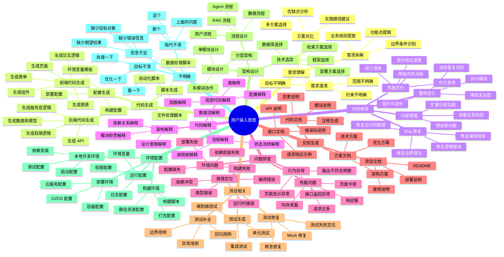

# RAG 意图识别树

```mermaid
mindmap
  root((用户输入意图))
    需求理解
      需求拆解
        功能点提取
        业务规则提取
        边界条件识别
      需求澄清
        目标不明确
        范围不明确
        约束不明确
      方案对比
        多方案选择
        优缺点分析
        实施路径建议
    代码生成
      前端代码生成
        生成页面
        生成组件
        生成表单
        生成图表
        生成交互逻辑
      后端代码生成
        生成 API
        生成数据库模型
        生成服务层逻辑
        生成权限逻辑
      脚本生成
        数据处理脚本
        文件处理脚本
        自动化脚本
      配置生成
        构建配置
        部署配置
        环境变量模板
    代码修改
      功能增强
        增加新功能
        扩展已有功能
        调整业务规则
      Bug 修复
        修复编译错误
        修复运行时报错
        修复逻辑错误
        修复边界情况
      重构优化
        拆分模块
        降低复杂度
        提升可读性
        消除重复代码
      性能优化
        优化查询
        减少渲染
        降低内存消耗
        提升响应速度
    代码解释
      局部代码解释
        函数解释
        类解释
        配置解释
      流程解释
        调用链解释
        数据流解释
        状态流转解释
      架构解释
        模块职责解释
        依赖关系解释
        设计意图解释
    问题排查
      报错定位
        编译错误
        运行时错误
        类型错误
        依赖冲突
      行为异常
        输出不符合预期
        页面显示异常
        接口返回异常
      性能问题
        响应慢
        页面卡顿
        内存泄漏
        请求过多
      环境问题
        依赖安装失败
        构建失败
        部署失败
        配置缺失
    文档生成
      项目文档
        README
        使用说明
        部署说明
      接口文档
        API 说明
        请求响应示例
        错误码说明
      代码文档
        注释生成
        模块说明
        变更说明
      方案文档
        技术方案
        架构方案
        优化方案
    测试相关
      测试生成
        单元测试
        集成测试
        端到端测试
      测试修复
        测试失败定位
        断言修复
        Mock 修复
      测试补全
        边界用例
        异常用例
        回归用例
    架构设计
      模块设计
        单模块设计
        多模块协作
        分层架构
      技术选型
        框架选择
        数据库选择
        检索方案选择
        部署方案选择
      流程设计
        用户流程
        数据流程
        Agent 流程
        RAG 流程
    环境配置
      本地开发环境
        依赖安装
        启动配置
        调试配置
      构建环境
        构建脚本
        打包配置
        静态资源配置
      部署环境
        容器配置
        CI/CD 配置
        云服务配置
      运行配置
        环境变量
        权限配置
        日志配置
    不明确
      指代不清
        这个
        那个
        上面的问题
      目标不清
        处理一下
        优化一下
        看一下
      信息不足
        缺少目标对象
        缺少错误信息
        缺少期望结果
```

## 简化版意图树

```mermaid
graph TD
  A[用户输入意图]

  A --> B[需求理解]
  A --> C[代码生成]
  A --> D[代码修改]
  A --> E[代码解释]
  A --> F[问题排查]
  A --> G[文档生成]
  A --> H[测试相关]
  A --> I[架构设计]
  A --> J[环境配置]
  A --> K[不明确]

  B --> B1[需求拆解]
  B --> B2[需求澄清]
  B --> B3[方案对比]

  C --> C1[前端代码生成]
  C --> C2[后端代码生成]
  C --> C3[脚本生成]
  C --> C4[配置生成]

  D --> D1[功能增强]
  D --> D2[Bug 修复]
  D --> D3[重构优化]
  D --> D4[性能优化]

  E --> E1[局部代码解释]
  E --> E2[流程解释]
  E --> E3[架构解释]

  F --> F1[报错定位]
  F --> F2[行为异常]
  F --> F3[性能问题]
  F --> F4[环境问题]

  G --> G1[项目文档]
  G --> G2[接口文档]
  G --> G3[代码文档]
  G --> G4[方案文档]

  H --> H1[测试生成]
  H --> H2[测试修复]
  H --> H3[测试补全]

  I --> I1[模块设计]
  I --> I2[技术选型]
  I --> I3[流程设计]

  J --> J1[本地开发环境]
  J --> J2[构建环境]
  J --> J3[部署环境]
  J --> J4[运行配置]

  K --> K1[指代不清]
  K --> K2[目标不清]
  K --> K3[信息不足]
```
