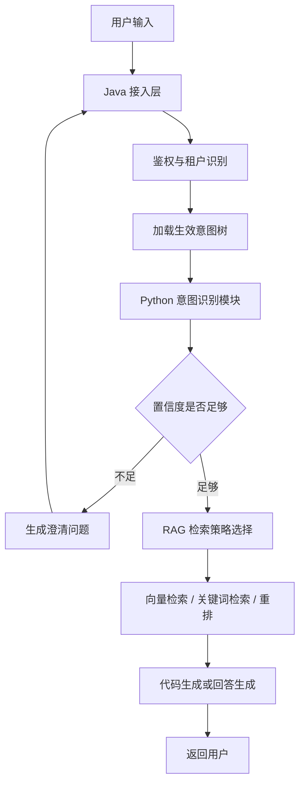
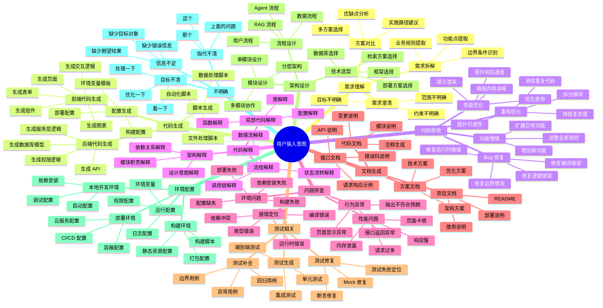

# RAG 意图识别优化方案：默认意图树与管理员自定义意图树

## 1. 目标

项目流程是：用户输入自然语言与大模型交互，大模型根据用户要求生成代码。当前要优化的是 RAG 前置或中间阶段的意图识别能力，使系统能够：

- 判断用户真正想完成什么任务。
- 将用户输入映射到树形意图分类。
- 在置信度不足、需求模糊或存在多种解释时，主动引导用户澄清。
- 将识别出的意图、槽位、上下文约束和澄清结果传递给后续 RAG 检索与代码生成流程。
- 支持管理员自定义意图树，让不同业务、团队、租户或项目可以使用自己的意图分类。

本文将之前设计的意图树作为系统默认意图树。默认意图树用于开箱即用，自定义意图树用于业务扩展。

## 2. 总体设计

推荐采用：

```text
默认意图树
+ 管理员自定义意图树
+ 槽位抽取
+ 置信度门控
+ 主动澄清
+ 意图驱动 RAG
```

整体流程：



Java 层负责：

- 鉴权、租户识别、角色识别。
- 判断用户当前可使用哪棵意图树。
- 管理员维护意图树、版本、发布和回滚。
- 保存意图识别结果、澄清状态和识别日志。

Python 层负责：

- 根据生效意图树做意图识别。
- 槽位抽取。
- 置信度判断。
- 澄清问题生成。
- Query Rewrite。
- RAG 检索与代码生成。

## 3. 默认意图树

默认意图树是系统内置分类，适合大多数代码生成类 RAG 场景。它不依赖管理员配置，系统初始化后即可使用。

### 3.1 默认一级意图

| 一级意图 | 含义 |
|---|---|
| 需求理解 | 用户在描述想法、目标、业务规则，需要系统理解并拆解 |
| 代码生成 | 用户希望生成新代码、组件、接口、脚本、配置等 |
| 代码修改 | 用户希望修改已有代码、修复问题、调整逻辑 |
| 代码解释 | 用户希望解释已有代码、架构、流程或错误原因 |
| 问题排查 | 用户遇到报错、异常、性能问题或行为不符合预期 |
| 文档生成 | 用户希望生成 README、接口文档、注释、方案文档等 |
| 测试相关 | 用户希望生成测试、补充用例、定位测试失败 |
| 架构设计 | 用户希望获得技术方案、模块划分、系统设计建议 |
| 环境配置 | 用户希望配置依赖、部署、构建、CI/CD、运行环境 |
| 不明确 | 无法可靠判断用户意图 |

### 3.2 默认意图树结构



## 4. 管理员自定义意图树

### 4.1 设计目的

默认意图树覆盖通用代码生成场景，但真实项目可能存在业务差异。例如：

- 电商系统需要“商品管理、订单处理、支付退款、库存同步”等意图。
- 数据分析系统需要“指标查询、报表生成、数据清洗、异常检测”等意图。
- 低代码平台需要“页面搭建、流程编排、权限配置、表单建模”等意图。
- 多租户 AI 编程平台需要为不同团队配置不同开发规范和任务分类。

因此系统需要支持管理员创建、维护、测试、发布和回滚自定义意图树。

### 4.2 自定义模式

建议支持三种模式：

| 模式 | 说明 | 适用场景 |
|---|---|---|
| 继承默认树 | 默认树仍然存在，管理员只新增或调整部分节点 | 第一版推荐 |
| 覆盖默认树 | 管理员定义完整意图树，默认树不参与识别 | 强业务定制 |
| 混合树 | 默认树和自定义树同时参与识别，自定义树优先级更高 | 多租户复杂场景 |

第一版建议采用“继承默认树”。这样即使管理员配置不完整，系统仍可回退到默认能力。

## 5. 自定义意图树数据结构

### 5.1 意图树字段

| 字段 | 说明 |
|---|---|
| tree_id | 意图树 ID |
| tree_name | 意图树名称 |
| tenant_id | 所属租户，平台默认树可为空 |
| scope | 生效范围：global / tenant / project / user_group |
| base_tree_id | 继承的基础树 ID |
| version | 版本号 |
| status | draft / published / archived |
| priority | 优先级 |
| description | 意图树说明 |
| created_by | 创建管理员 |
| updated_by | 最近修改人 |
| published_at | 发布时间 |

### 5.2 意图节点字段

| 字段 | 说明 |
|---|---|
| node_id | 节点 ID |
| parent_id | 父节点 ID |
| tree_id | 所属意图树 ID |
| intent_code | 稳定编码，例如 `code.generate.backend.api` |
| intent_name | 展示名称，例如“生成 API” |
| level | 节点层级 |
| description | 意图定义 |
| examples | 典型用户表达 |
| negative_examples | 不属于该意图的表达 |
| keywords | 关键词和触发词 |
| required_slots | 必填槽位 |
| optional_slots | 可选槽位 |
| clarification_templates | 澄清问题模板 |
| retrieval_strategy | RAG 检索策略 |
| confidence_threshold | 该节点的置信度阈值 |
| enabled | 是否启用 |
| sort_order | 排序 |

### 5.3 节点配置示例

```json
{
  "intent_code": "code.modify.bug.runtime_error",
  "intent_name": "修复运行时报错",
  "description": "用户希望定位并修复运行时错误，例如 500、NullPointerException、接口异常等。",
  "examples": [
    "这个接口报 500，帮我看下",
    "运行时报空指针，帮我修复",
    "启动后直接崩了"
  ],
  "negative_examples": [
    "帮我生成一个新接口",
    "解释一下这个函数"
  ],
  "keywords": ["报错", "异常", "500", "NullPointerException", "崩溃"],
  "required_slots": ["error_message", "target_object", "expected_behavior"],
  "optional_slots": ["reproduce_steps", "recent_changes"],
  "clarification_templates": [
    "你能提供具体错误信息或日志吗？",
    "这个报错出现在哪个接口、页面或任务里？"
  ],
  "retrieval_strategy": {
    "prefer": ["error_logs", "related_code", "test_failures", "call_chain"],
    "hybrid_search": true,
    "rerank": true
  },
  "confidence_threshold": 0.75,
  "enabled": true
}
```

## 6. 管理端功能

管理员后台建议提供以下能力：

| 功能 | 说明 |
|---|---|
| 查看默认意图树 | 查看系统内置树，不允许直接修改 |
| 复制默认树 | 基于默认树创建自定义树 |
| 新增节点 | 添加一级、二级、三级或更深层节点 |
| 编辑节点 | 修改名称、描述、示例、槽位、澄清模板 |
| 禁用节点 | 临时关闭某个意图，不删除历史记录 |
| 调整排序 | 控制展示顺序和识别提示顺序 |
| 设置阈值 | 为不同意图设置不同置信度阈值 |
| 配置检索策略 | 不同意图映射不同 RAG 检索范围 |
| 草稿保存 | 修改后先保存为草稿 |
| 发布版本 | 校验通过后发布为正式版本 |
| 回滚版本 | 出现识别异常时回滚到历史版本 |
| 测试识别 | 输入样例文本，预览识别结果 |
| 导入导出 | 支持 JSON 导入导出，方便迁移 |

重要原则：

- 默认意图树不可直接编辑，只能复制或继承。
- 自定义树必须先保存草稿，再发布生效。
- 已发布版本不直接修改，修改会产生新草稿版本。
- 所有发布和回滚操作都要记录审计日志。

## 7. 生效规则

### 7.1 意图树选择优先级

一次用户请求进入系统后，需要先判断使用哪棵意图树。

推荐优先级：

```text
项目级自定义意图树
> 租户级自定义意图树
> 用户组自定义意图树
> 平台全局自定义意图树
> 系统默认意图树
```

如果高优先级意图树不存在或未发布，则向下回退。

### 7.2 默认树和自定义树合并规则

第一版建议采用“默认树 + 自定义增量”的合并规则：

| 情况 | 行为 |
|---|---|
| 自定义新增节点 | 添加到默认树对应位置 |
| 自定义修改节点 | 覆盖默认节点的描述、示例、槽位、阈值 |
| 自定义禁用节点 | 识别时不再使用该节点 |
| 自定义未配置字段 | 继承默认节点字段 |
| 自定义节点编码冲突 | 不允许发布，必须修改 |

## 8. 发布前校验

管理员发布意图树前，系统必须做结构校验。

必须校验：

- 意图树必须有根节点。
- 节点不能形成循环引用。
- 同一棵树中 `intent_code` 必须唯一。
- 节点名称不能为空。
- 启用节点必须有描述。
- 叶子节点建议配置示例。
- 必填槽位必须来自槽位字典。
- 澄清模板不能包含内部字段名。
- 删除或禁用节点时，需要检查是否有正在使用的策略引用。
- RAG 检索策略必须是系统支持的策略。

建议校验：

- 同级节点名称不要过于相似。
- 同级节点关键词不要高度重叠。
- 叶子节点数量不要过多。
- 树深度建议控制在 3 到 5 层。
- 单个节点示例建议不少于 3 条。

## 9. 槽位字典管理

自定义意图树需要配套槽位字典，否则管理员容易写出不一致的槽位名。

| 类型 | 示例 |
|---|---|
| 系统内置槽位 | target_object、desired_outcome、constraints、output_format |
| 代码类槽位 | framework、file_path、function_name、api_name、error_message |
| RAG 类槽位 | project_id、document_type、retrieval_scope、knowledge_base |
| 业务自定义槽位 | order_id、product_id、workflow_name、report_metric |

槽位字段建议包含：

| 字段 | 说明 |
|---|---|
| slot_code | 槽位编码 |
| slot_name | 槽位名称 |
| description | 槽位说明 |
| value_type | string / number / enum / boolean / array / object |
| required_by_default | 是否默认必填 |
| extraction_hint | 给模型的抽取提示 |
| clarification_template | 缺失时的澄清问题 |

## 10. 意图识别输出结构

意图识别模块不应只输出一个标签，而应输出结构化结果。

| 字段 | 说明 |
|---|---|
| tree_id | 本次使用的意图树 ID |
| tree_version | 本次使用的意图树版本 |
| primary_intent | 最可能的意图路径 |
| primary_intent_code | 最可能的意图编码 |
| secondary_intents | 可能的次要意图 |
| confidence | 总体置信度 |
| confidence_reason | 为什么这样判断 |
| key_entities | 用户提到的关键对象 |
| slots | 已抽取槽位 |
| missing_slots | 缺失但重要的槽位 |
| ambiguity_points | 歧义点 |
| should_clarify | 是否需要澄清 |
| clarification_questions | 推荐澄清问题 |
| retrieval_hint | 给 RAG 检索模块的提示 |
| matched_examples | 命中的示例或规则 |

必须记录 `tree_id` 和 `tree_version`，否则后续评估时无法知道当时是基于哪版意图树识别的。

## 11. 置信度策略

置信度不建议只依赖模型自评，应组合多个信号。

| 信号 | 说明 |
|---|---|
| 模型分类置信度 | LLM 对意图标签的自评 |
| 关键词匹配 | 是否命中管理员配置的关键词 |
| 示例相似度 | 用户输入是否接近管理员配置的 examples |
| 槽位完整度 | 完成该意图所需信息是否充足 |
| 意图冲突度 | 是否同时像多个意图 |
| 上下文一致性 | 当前输入是否延续上一轮任务 |
| 检索可支持度 | RAG 是否能找到足够相关材料 |

推荐阈值：

| 置信度区间 | 行为 |
|---|---|
| 0.80 - 1.00 | 直接执行 |
| 0.60 - 0.79 | 带假设执行，必要时轻量确认 |
| 0.40 - 0.59 | 先问 1 到 2 个关键澄清问题 |
| 0.00 - 0.39 | 不执行，必须澄清用户目标 |

如果某个自定义意图节点配置了独立 `confidence_threshold`，优先使用节点阈值。

## 12. 主动澄清机制

澄清应由三个来源共同决定：

- 意图置信度不足。
- 当前意图的必填槽位缺失。
- 当前意图节点配置了专属澄清模板。

澄清问题优先级：

```text
节点专属澄清模板
> 槽位字典澄清模板
> 系统通用澄清模板
```

示例：

如果管理员定义了自定义意图：

```text
业务报表 / 指标查询 / 查询 GMV
```

并设置必填槽位：

```text
metric_name、time_range、group_by
```

当用户输入：

```text
帮我看一下 GMV
```

系统应澄清：

```text
你想查看哪个时间范围的 GMV？例如今天、本周、本月或自定义时间段。
```

## 13. RAG 如何使用自定义意图树

自定义意图树不只是分类标签，还应影响 RAG 检索策略。

每个叶子意图可以配置：

| 配置 | 说明 |
|---|---|
| retrieval_scope | 检索范围，例如 project / module / document / log |
| document_types | 优先检索文档类型 |
| code_scopes | 优先检索代码范围 |
| query_rewrite_template | Query Rewrite 模板 |
| rerank_enabled | 是否启用重排 |
| top_k | 召回数量 |
| fallback_strategy | 检索不足时的回退策略 |

示例：

| 意图 | 优先检索内容 |
|---|---|
| 代码生成 | 相似组件、模板、接口规范、项目约定 |
| 代码修改 | 目标文件、调用链、测试、相关历史实现 |
| Bug 修复 | 错误日志、相关代码、issue、测试失败信息 |
| 架构设计 | README、架构文档、模块边界、目录结构 |
| 自定义业务查询 | 业务字典、指标口径、数据模型、接口文档 |

## 14. Prompt 设计调整

引入自定义意图树后，Prompt 不应写死默认意图树，而应动态注入当前生效意图树。

Prompt 输入应包含：

- 当前用户输入。
- 最近几轮对话摘要。
- 当前生效意图树摘要。
- 候选意图节点列表。
- 每个候选节点的定义、示例、反例、槽位。
- 置信度规则。
- 澄清策略。
- 输出 JSON Schema。

注意：

- 不要把整棵超大意图树全部塞进 Prompt。
- 可以先用关键词、示例向量、父节点召回候选意图，再把候选节点注入 Prompt。
- 对大型自定义树，应采用“候选意图召回 + LLM 精排”的两阶段识别。

推荐流程：

```text
用户输入
  -> 根据关键词和向量相似度召回候选意图节点
  -> 注入候选节点到 Prompt
  -> LLM 输出结构化意图识别结果
  -> 根据阈值和槽位完整度判断是否澄清
```

## 15. 管理端交互建议

管理员配置页建议分为四个区域：

1. 意图树结构区：左侧树形编辑器。
2. 节点配置区：右侧编辑名称、描述、示例、槽位、阈值。
3. 测试区：输入用户问题，实时查看识别结果。
4. 发布区：校验、发布、回滚、查看版本历史。

管理端应避免让管理员直接写复杂 Prompt，而是通过表单配置：

- 意图名称。
- 意图定义。
- 正例。
- 反例。
- 关键词。
- 必填槽位。
- 澄清问题模板。
- RAG 检索策略。

系统再自动将这些配置转换为意图识别 Prompt。

## 16. 权限与安全

自定义意图树属于高影响配置，需要权限控制。

| 角色 | 权限 |
|---|---|
| 超级管理员 | 管理全局默认扩展树、查看所有租户配置 |
| 租户管理员 | 管理本租户意图树 |
| 项目管理员 | 管理本项目意图树 |
| 普通用户 | 只能使用生效意图树，不能修改 |

安全要求：

- 发布、回滚、删除、禁用节点都要记录审计日志。
- 自定义 Prompt 片段要限制长度。
- 管理员配置的示例和澄清模板要做敏感词和注入风险检查。
- 不允许管理员配置绕过鉴权、读取密钥、删除数据等危险指令。
- Python AI 服务不能直接信任管理员配置，仍需结构校验。

## 17. 缓存与性能

意图树配置读取频率高，不建议每次请求都查数据库并完整组装。

| 缓存内容 | 建议 |
|---|---|
| 生效意图树 | Redis 或本地 Caffeine 缓存 |
| 候选意图索引 | 向量库或内存索引 |
| 节点关键词 | 本地缓存 |
| 槽位字典 | 本地缓存 |
| 树版本信息 | Redis 缓存 |

发布新版本时：

1. 数据库写入新版本。
2. 更新生效版本号。
3. 清理 Java 本地缓存。
4. 清理 Python 本地缓存。
5. 重建候选意图索引。

要保证一次请求全程使用同一个 `tree_version`，避免识别和执行阶段版本不一致。

## 18. 数据库表建议

建议至少设计以下表：

| 表 | 用途 |
|---|---|
| `intent_tree` | 意图树主表 |
| `intent_tree_version` | 意图树版本表 |
| `intent_node` | 意图节点表 |
| `intent_slot` | 槽位字典表 |
| `intent_node_slot` | 节点与槽位关系表 |
| `intent_retrieval_strategy` | 意图检索策略表 |
| `intent_publish_record` | 发布记录表 |
| `intent_audit_log` | 管理操作审计日志 |
| `intent_recognition_log` | 用户请求识别日志 |
| `intent_eval_sample` | 评估样本表 |

关键点：

- 不要只保存当前树，要保存历史版本。
- 用户识别日志必须记录当时使用的版本。
- 发布版本应是不可变快照，便于回滚和复盘。

## 19. 接口设计建议

管理端接口：

| 接口 | 说明 |
|---|---|
| 创建意图树 | 基于默认树或空树创建 |
| 查询意图树 | 查询树结构和节点配置 |
| 新增节点 | 添加节点 |
| 编辑节点 | 修改节点配置 |
| 禁用节点 | 临时关闭节点 |
| 校验意图树 | 发布前结构校验 |
| 测试意图识别 | 使用草稿树试跑样例 |
| 发布版本 | 发布为生效版本 |
| 回滚版本 | 回滚到历史版本 |
| 导入导出 | JSON 导入导出 |

业务识别接口：

| 接口 | 说明 |
|---|---|
| 意图识别 | 根据用户、租户、项目加载生效树并识别 |
| 澄清提交 | 用户回答澄清问题后继续识别 |
| 识别日志查询 | 用于运营和评估 |
| 失败样本标注 | 将失败案例加入评估集 |

## 20. 评估指标

自定义意图树上线后，需要分别评估默认树和自定义树效果。

| 指标 | 含义 |
|---|---|
| 一级意图准确率 | 大方向是否判断正确 |
| 叶子意图准确率 | 最细粒度分类是否正确 |
| 自定义意图命中率 | 用户输入是否正确命中自定义节点 |
| 默认树回退率 | 自定义树未命中后回退默认树的比例 |
| 澄清触发准确率 | 该问的时候是否问了 |
| 过度澄清率 | 明明可以执行却频繁追问 |
| 槽位抽取准确率 | 是否正确提取目标、约束、错误信息等 |
| RAG 命中提升 | 意图加入后检索结果是否更相关 |
| 最终任务成功率 | 代码生成或修改是否满足需求 |

管理员配置质量指标：

- 节点示例覆盖率。
- 节点关键词冲突率。
- 发布后识别失败率。
- 回滚次数。
- 自定义节点长期未命中数量。

## 21. 落地路线

### 第一阶段：默认意图树落地

目标：

- 使用默认意图树完成基础意图识别。
- 输出结构化识别结果。
- 支持置信度和槽位驱动澄清。

产出：

- 默认意图树。
- 槽位字典。
- 意图识别 Prompt。
- 识别日志。

### 第二阶段：自定义树草稿能力

目标：

- 后台可以查看默认意图树。
- 支持复制默认树为自定义树。
- 支持编辑草稿，但暂不影响线上识别。

产出：

- 意图树表结构。
- 节点表结构。
- 管理端树形编辑页面。

### 第三阶段：发布与生效

目标：

- 支持校验、发布、回滚。
- 用户请求按租户或项目加载生效树。
- 意图识别结果记录 `tree_id` 和 `tree_version`。

产出：

- 发布流程。
- 版本快照。
- 缓存刷新机制。
- 审计日志。

### 第四阶段：测试与评估

目标：

- 管理员可以输入样例测试识别效果。
- 支持把失败样本加入评估集。
- 输出默认树和自定义树的效果指标。

产出：

- 测试识别接口。
- 评估样本库。
- 识别效果报表。

### 第五阶段：高级能力

目标：

- 大型意图树支持候选召回。
- 支持自定义 RAG 检索策略。
- 支持不同租户、项目、用户组使用不同树。

产出：

- 意图节点向量索引。
- 候选意图召回。
- 自定义检索策略。
- 多租户生效规则。

## 22. 常见风险与规避

### 22.1 管理员把意图树配置得过细

风险：

节点过多、层级过深，会导致识别不稳定。

建议：

控制树深度在 3 到 5 层，低频意图先归入“其他”或“待分类”，观察数据后再拆分。

### 22.2 自定义节点之间语义重叠

风险：

多个节点定义相似，模型难以区分。

建议：

每个节点必须配置正例和反例。发布前检测同级节点关键词和示例相似度。

### 22.3 配置错误导致线上识别变差

风险：

管理员发布错误版本后，影响所有用户。

建议：

必须支持草稿、测试、发布、灰度、回滚。第一版至少要有发布前测试和回滚。

### 22.4 Prompt 过长

风险：

自定义树过大时，把整棵树注入 Prompt 会增加成本并降低稳定性。

建议：

采用候选意图召回，只把最相关的候选节点传给 LLM。

### 22.5 自定义配置引入 Prompt 注入风险

风险：

管理员配置的示例或模板可能包含不安全指令。

建议：

对配置内容做长度限制、敏感指令检测和结构化约束。不要让管理员直接编辑系统级 Prompt。

## 23. 推荐最终方案

建议最终采用：

```text
系统默认意图树
+ 管理员自定义增量树
+ 版本化发布
+ 生效树缓存
+ 候选意图召回
+ LLM 结构化识别
+ 槽位驱动澄清
+ 意图驱动 RAG 检索
```

第一版最小可行方案：

1. 保留系统默认意图树。
2. 管理员可以复制默认树。
3. 管理员可以新增、编辑、禁用节点。
4. 自定义树必须通过校验后发布。
5. 用户请求按租户或项目加载生效树。
6. 意图识别输出记录 `tree_id` 和 `tree_version`。
7. 低置信度或缺少槽位时主动澄清。
8. 识别日志进入评估样本库，持续优化默认树和自定义树。

一句话总结：

```text
默认意图树保证系统开箱即用，自定义意图树保证业务可扩展，版本化和校验机制保证线上稳定。
```
