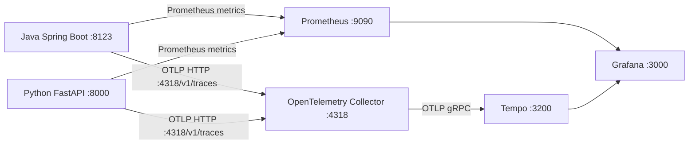

# Grafana + Prometheus + Tempo 使用指南

适用于 `RainN0Coding` 的本地可观测性环境。

当前方案分成两条链路：
- 指标链路：Spring Boot / FastAPI -> Prometheus -> Grafana
- 追踪链路：Spring Boot / FastAPI -> OpenTelemetry Collector -> Tempo -> Grafana

## 架构



## 启动顺序

### 1. 启动 Python FastAPI

```bash
cd python-agent
PYTHONPATH=. .venv/Scripts/python.exe server/main.py
```

### 2. 启动 Java Spring Boot

按你平时的方式启动即可，确保这些端点可用：

- `http://localhost:8123/api/actuator/prometheus`
- `http://localhost:8123/api/actuator/health`

### 3. 启动 Prometheus

```bash
prometheus --config.file=prometheus.yml
```

Prometheus 继续抓取：

- Java: `localhost:8123/api/actuator/prometheus`
- Python: `localhost:8000/metrics`

### 4. 启动可视化和追踪栈

```bash
docker compose -f docker-compose.monitoring.yml up -d
```

这个命令会启动：

- Grafana
- Tempo
- OpenTelemetry Collector

Grafana 登录信息：

- 用户名: `admin`
- 密码: `admin`

## Trace 配置

当前默认配置已经在代码里写好，不需要额外改代码就能把 trace 发到本机：

- Java:
  - `OTEL_EXPORTER_OTLP_TRACES_ENDPOINT=http://localhost:4318/v1/traces`
- Python:
  - 默认也会走 `http://localhost:4318/v1/traces`

如果你想换地址，只要把 Java 和 Python 的 OTLP endpoint 一起改掉即可。

## 在 Grafana 里看什么

进入 `http://localhost:3000` 后：

1. 看指标
   - `Dashboards` -> `AI Workflow Monitoring`
   - `Dashboards` -> `AI Model Monitoring`
2. 看追踪
   - `Explore`
   - 数据源选 `Tempo`
   - 搜索最近一次请求的 trace

Grafana 的 Tempo 数据源已经自动预置：

- 文件: `grafana/datasources/tempo.yml`

## 验证是否正常

### Prometheus

```bash
curl http://localhost:9090/-/healthy
```

### Grafana

```bash
curl http://localhost:3000/api/health
```

### Collector

```bash
docker compose -f docker-compose.monitoring.yml ps
```

你应该能看到：

- `grafana`
- `tempo`
- `otel-collector`

### 端到端 trace

发起一次代码生成请求后，应该能看到：

- Java 网关里有当前 traceId
- Python SSE payload 里有同一个 traceId
- Grafana Explore 里能查到 Tempo 中对应 trace

示例请求：

```bash
curl -X POST http://localhost:8000/api/generate-code \
  -H "Content-Type: application/json" \
  -d '{"userId":"test","appId":"demo","prompt":"做一个登录页"}'
```

## 停止服务

### Windows

```bash
docker compose -f docker-compose.monitoring.yml down
```

然后按原来的方式停止 Python、Prometheus、Java。

### 其他 shell

同样执行：

```bash
docker compose -f docker-compose.monitoring.yml down
```

## 常见问题

- Grafana 打不开
  - 先看 `docker compose -f docker-compose.monitoring.yml ps`
  - 再看 `http://localhost:3000/api/health`
- Trace 查不到
  - 确认 Collector 正常监听 `4318`
  - 确认 Java 和 Python 都把 OTLP endpoint 指到 `http://localhost:4318/v1/traces`
  - 确认你已经触发过一次生成请求
- Tempo 里没有数据
  - 先确认 Collector 日志里没有 exporter 错误
  - 再确认 Tempo 容器已启动

## 相关文件

- `docker-compose.monitoring.yml`
- `otel-collector-config.yml`
- `tempo.yaml`
- `grafana/datasources/prometheus.yml`
- `grafana/datasources/tempo.yml`
